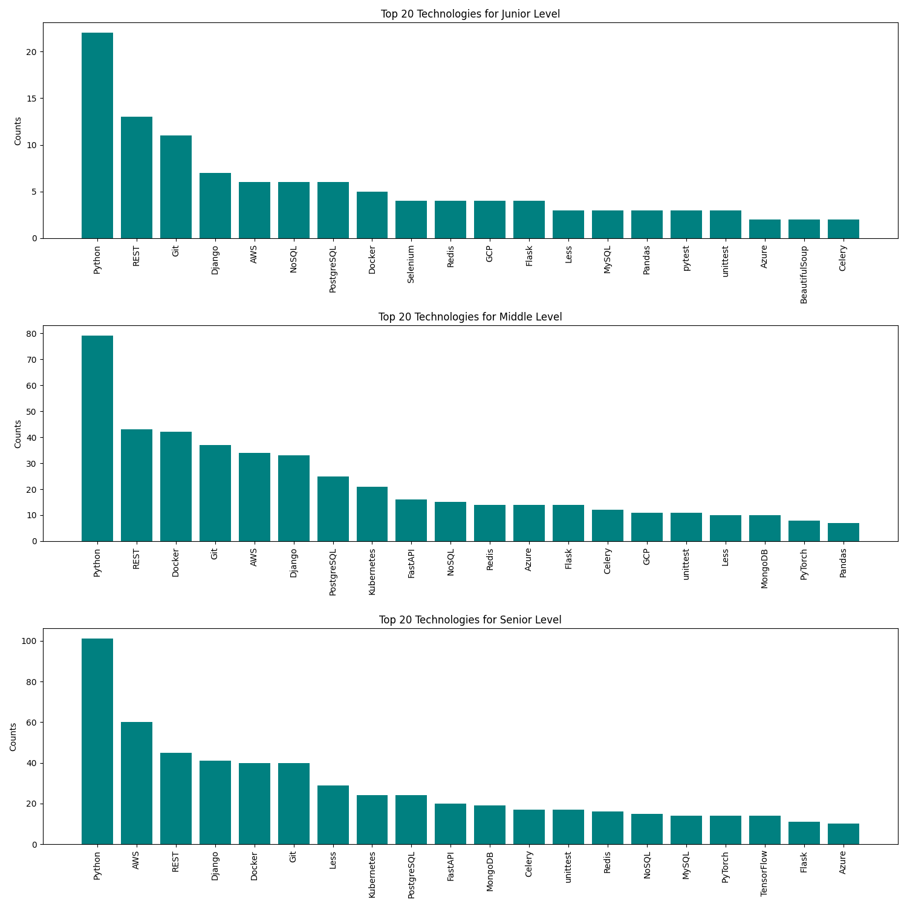

# Python Job Market Analysis

## Overview
This project is designed to analyze and understand the current market demand 
for various technologies in the field of Python development. By scraping job 
vacancies from the Djinni platform and analyzing the frequency of technology 
mentions in job descriptions, this tool provides insights into the most sought-after technologies.

## Installation
1) Open the terminal and navigate to the folder where you want to clone the repository.
    ```
    cd path/to/your/directory
    ```

2) Use the git clone command to clone the repository.
   ```
   git clone https://github.com/katyakoziar/python_technologies_analysis.git
   ```
3) Create and activate a virtual environment:
   ```angular2html
   python -m venv venv
   ```
   - for Windows:
   ```angular2html
   .\venv\Scripts\activate
   ```
   - for Linux/Mac:
   ```angular2html
   source venv/bin/activate
   ```
   
4) Use pip to install the requirements.
   ```angular2html
   pip install -r requirements.txt
   ```
5) Go to [main.py](main.py) and run code.
   ```angular2html
   python main.py
   ```

## Results
The results of scraping and visualization are saved in `data/` directory.
You can view the most popular Python technologies at the time of program creation 
for junior, middle and senior experience (junior - up to 1 year of experience, 
middle - from 1 to 3 years, senior - more than 3 years). 

